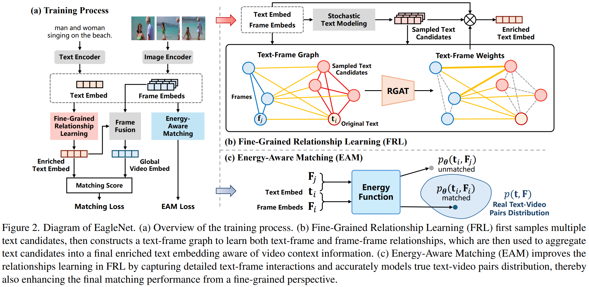

# EagleNet: Energy-Aware Fine-Grained Relationship Learning Network for Text-Video Retrieval

English | [中文](./README_zh.md)

Our paper is accepted by **CVPR 2026**, by [Yuhan Chen](https://github.com/draym28), [Pengwen Dai](https://scst.sysu.edu.cn/teacher/DaiPengwen), [Chuan Wang](https://chuanwang-cv.github.io/), [Dayan Wu](https://wudayan92.github.io/), [Xiaochun Cao](https://scst.sysu.edu.cn/teacher/CaoXiaochun).

Paper link: [[arXiv]](https://arxiv.org/abs/2603.25267v2).

## Introduction

EagleNet generates accurate and context-aware enriched text embeddings, incorporating both text-frame interactions and internal frame-frame relations within a video. 
- Fine-Grained Relationship Learning (FRL) first constructs a text-frame graph by the generated text candidates and frames, then learns relationships among texts and frames, which are finally used to aggregate text candidates into an enriched text embedding that incorporates frame contextual information. 
- Energy-Aware Matching (EAM) to model the energy of text-frame interactions and thus accurately capture the distribution of real text-video pairs, further improving the fine-grained relationship learning in FRL. 
- We replace the conventional softmax-based contrastive loss with the sigmoid loss for more effective cross-modal alignment and stable training. 

EagleNet achieve SOTA results on MSRVTT (R@1 51.0%), DiDeMo (51.5%), MSVD (50.9%), and VATEX (63.6%).



## Code Structure

This directory contains a CLIP-based **video-text retrieval** implementation. 
- The main entry-point is `main_my.py`. 
- Training/evaluation loops are in `train_and_eval.py`.
- Arguments are defined in `args.py`.
- Dataset files are put in `./data/`, and best checkpoints are put in `./best_ckpts/`.
- Shell scripts are provided for MSR-VTT (9k), DiDeMo, MSVD, and VATEX.

## Requirements

It is recommended to use a dedicated Conda (or venv) environment. The dependency set is consistent with [CLIP4Clip](https://github.com/ArrowLuo/CLIP4Clip)-style projects.

1. Create conda environment:

```bash
conda create -n eaglenet python=3.8
conda activate eaglenet
```

2. install pytorch: `torch=1.12.1`, `torchvision=0.13.1`.

3. install other dependencies:
```bash
ftfy
regex
tqdm
opencv-python
boto3
requests
pandas
```

If you train with multiple GPUs (distributed), make sure `torch.distributed` works and your NCCL/driver setup is correct.

## Datasets

We test our model on MSRVTT, DiDeMo, MSVD, and VATEX. Please refer to [CLIP4Clip](https://github.com/ArrowLuo/CLIP4Clip) for the first 3 datasets and [TS2-Net](https://github.com/LiuRicky/ts2_net) for VATEX.

(Optional) We follow [CLIP4Clip](https://github.com/ArrowLuo/CLIP4Clip) to compress all videos to 3fps, 224*224 for speed-up:
```bash
python preprocess/compress_video.py --input_root [raw_video_path] --output_root [compressed_video_path]
```

We also provide link for downloading the original/compressed videos via [Baidu Netdisk](https://pan.baidu.com/s/1OlrADWgLE9fWUdieB0JX_Q?pwd=qasj).

The splits/annotations can be downloaded via [Google Driver](https://drive.google.com/drive/folders/1nqJfU2dYYJYNcT6X1yBCkhnj6Z0j4zHw?usp=drive_link) or [Baidu Netdisk](https://pan.baidu.com/s/1a6HoHzwp3UFJPhA3_Pk5Zg?pwd=ckch).

The data files are structured as follow:
```text
.
├── data/
│   ├── MSRVTT/
│   │   ├── msrvtt_data/
│   │   │   ├── MSRVTT_data.json
│   │   │   ├── MSRVTT_train.9k.csv
│   │   │   ├── MSRVTT_train.7k.csv
│   │   │   └── MSRVTT_JSFUSION_test.csv
│   │   ├── videos/
│   │   │   └── all/
│   │   │       └── *.mp4
│   │   └── ...
│   ├── DiDeMo/
│   │   ├── annotation/
│   │   │   └── (split/annotation files used by the DiDeMo dataloader)
│   │   └── videos/
│   │       └── *.mp4
│   ├── MSVD/
│   │   ├── msvd_data/
│   │   │   └── (split/annotation files used by the MSVD dataloader)
│   │   └── videos/
│   │       └── *.avi
│   └── VATEX/
│       ├── vatex_data/
│       │   └── (split/annotation files used by the VATEX dataloader)
│       ├── videos/
│       │   └── *.mp4
│       └── ...
└── ...
```

The pretrained CLIP weights will be downloaded automatically. Or you can manually download

- CLIP (ViT-B/32) weights
```bash
wget -P ./modules https://openaipublic.azureedge.net/clip/models/40d365715913c9da98579312b702a82c18be219cc2a73407c4526f58eba950af/ViT-B-32.pt
```
- CLIP (ViT-B/16) weights
```bash
wget -P ./modules https://openaipublic.azureedge.net/clip/models/5806e77cd80f8b59890b7e101eabd078d9fb84e6937f9e85e4ecb61988df416f/ViT-B-16.pt
```
and put them under `~/.cache/clip/`.

## How to run

#### Train from scratch

```bash
bash run_train_msrvtt9k-vit_b_32.sh
bash run_train_msrvtt9k-vit_b_16.sh
bash run_train_didemo.sh
bash run_train_msvd.sh
bash run_train_vatex.sh
```

#### Evaluate on MSRVTT

EagleNet checkpoints for MSRVTT (ViT-B/32 & ViT-B/16) can be downloaded via [Google Driver](https://drive.google.com/drive/folders/1oy8nvyd6tbUqGVJZ44layuyaHSXcyQeP?usp=drive_link) or [Baidu Netdisk](https://pan.baidu.com/s/1Ps9iRkKOR9V8yQklGalY5Q?pwd=rief), and run

```bash
bash run_eval_msrvtt9k-vit_b_32.sh
bash run_eval_msrvtt9k-vit_b_16.sh
```

## Acknowledgments

We thank the developers of [CLIP](https://github.com/openai/CLIP), [CLIP4Clip](https://github.com/ArrowLuo/CLIP4Clip), [TS2-Net](https://github.com/LiuRicky/ts2_net), and [XPool](https://github.com/layer6ai-labs/xpool) for their public code release. 
